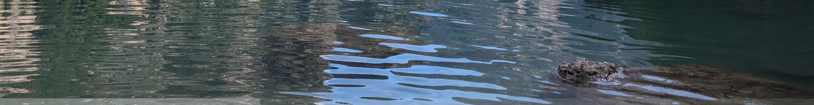
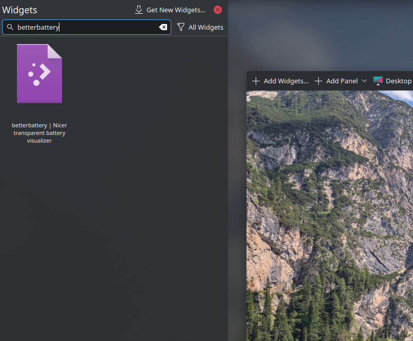
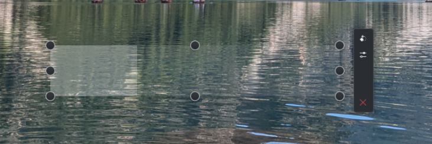

# Better battery - A battery charge visualization for KDE Plasma

This plasmoid (KDE Plasma widget) displays your current battery charge with a transparent progress bar.


The stripe at the bottom:



## Installation and Usage

KDE Plasma
```
cd ~/.local/share/plasma/plasmoids
git clone https://github.com/vgasparyan1995/betterbattery.git
```

And just like that a new widget is available in the catalog. _To access the catalog right click on the desktop and "Enter Edit Mode"._



The size and the position of the widget is customizable. As the progress bar is horizontal (reducing to the left) it makes sense for the width of the widget to be significantly larger than the height.



### Plasma limits

KDE Plasma sets minimum limits to the height and width of the widgets disallowing, for example, the hight of the widget to be _too short_. Those limits may be recunfigured by changing the `minimumItemWidth`/`minimumItemHeight` variables in _/usr/share/plasma/plasmoids/org.kde.desktopcontainment/contents/ui/main.qml_. They should be set relative to the desktop grid unit:


```
minimumItemWidth: Kirigami.Units.gridUnit * 3
minimumItemHeight: minimumItemWidth
```

For example, I changed the variables such to achieve smaller heights:

```
minimumItemWidth: Kirigami.Units.gridUnit / 2
minimumItemHeight: minimumItemWidth
```

## Known issues

Connecting an external display sometimes breaks the battery bar showing 0%. This may be easily fixed by restarting Plasma.

```
killall plasmashell; kstart5 plasmashell
```
